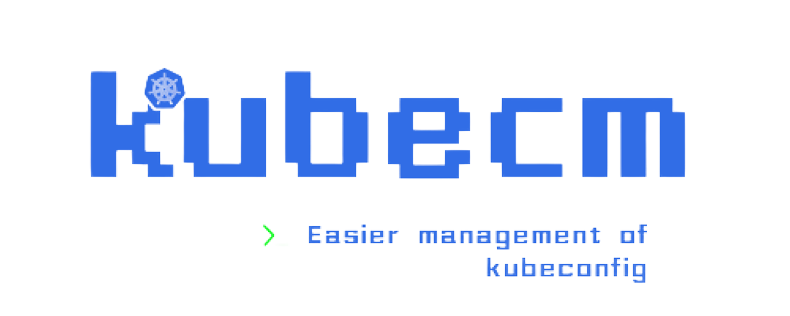

<p align="center">
    
</p>


[](https://goreportcard.com/report/github.com/sunny0826/kubecm)

[](https://github.com/sunny0826/kubecm/releases)
[](https://codecov.io/gh/sunny0826/kubecm)
[](https://bestpractices.coreinfrastructure.org/projects/6065)
[](#contributors-)

```text
                                                 
        Manage your kubeconfig more easily.        
                                                   

██   ██ ██    ██ ██████  ███████  ██████ ███    ███ 
██  ██  ██    ██ ██   ██ ██      ██      ████  ████ 
█████   ██    ██ ██████  █████   ██      ██ ████ ██ 
██  ██  ██    ██ ██   ██ ██      ██      ██  ██  ██ 
██   ██  ██████  ██████  ███████  ██████ ██      ██

 Tips  Find more information at: https://kubecm.cloud

Usage:
  kubecm [command]

Available Commands:
  add         Add KubeConfig to $HOME/.kube/config
  alias       Generate alias for all contexts
  clear       Clear lapsed context, cluster and user
  cloud       Manage kubeconfig from cloud
  completion  Generate completion script
  create      Create new KubeConfig(experiment)
  delete      Delete the specified context from the kubeconfig
  help        Help about any command
  list        List KubeConfig
  merge       Merge multiple kubeconfig files into one
  namespace   Switch or change namespace interactively
  rename      Rename the contexts of kubeconfig
  switch      Switch Kube Context interactively
  version     Print version info

Flags:
      --config string   path of kubeconfig (default "$HOME/.kube/config")
  -h, --help            help for kubecm
      --ui-size int     number of list items to show in menu at once (default 4)

Use "kubecm [command] --help" for more information about a command.
```

## Documentation 📃

For full documentation, please visit the KubeCM website: [https://kubecm.cloud](https://kubecm.cloud)

## Demo 🎬

[](https://asciinema.org/a/389595)

## Install 🚀

Using [Krew](https://krew.sigs.k8s.io/):

```bash
kubectl krew install kc
```

Using Homebrew:

```bash
brew install kubecm
```

Source binary:

[Download the binary](https://github.com/sunny0826/kubecm/releases)

## Contribute 🤝

Feel free to open issues and pull requests. Any feedback is highly appreciated! I'd be grateful if you can give me some feedback.

## Star History 📈

[](https://star-history.com/#sunny0826/kubecm)

## Contributors ✨

Thanks goes to these wonderful people ([emoji key](https://allcontributors.org/docs/en/emoji-key)):

<!-- ALL-CONTRIBUTORS-LIST:START - Do not remove or modify this section -->
<!-- prettier-ignore-start -->
<!-- markdownlint-disable -->
<table>
  <tbody>
    <tr>
      <td align="center" valign="top" width="14.28%"><a href="https://guoxudong.io/"><br /><sub><b>Xudong Guo</b></sub></a><br /><a href="https://github.com/sunny0826/kubecm/commits?author=sunny0826" title="Code">💻</a> <a href="https://github.com/sunny0826/kubecm/commits?author=sunny0826" title="Documentation">📖</a> <a href="#maintenance-sunny0826" title="Maintenance">🚧</a></td>
      <td align="center" valign="top" width="14.28%"><a href="https://github.com/astraw99"><br /><sub><b>Cheng Wang</b></sub></a><br /><a href="https://github.com/sunny0826/kubecm/commits?author=astraw99" title="Code">💻</a></td>
      <td align="center" valign="top" width="14.28%"><a href="https://nolebase.ayaka.io/"><br /><sub><b>Neko Ayaka</b></sub></a><br /><a href="https://github.com/sunny0826/kubecm/commits?author=nekomeowww" title="Code">💻</a></td>
      <td align="center" valign="top" width="14.28%"><a href="https://github.com/l1b0k"><br /><sub><b>l1b0k</b></sub></a><br /><a href="https://github.com/sunny0826/kubecm/commits?author=l1b0k" title="Code">💻</a></td>
      <td align="center" valign="top" width="14.28%"><a href="https://t.me/littlepoint"><br /><sub><b>Zhizhen He</b></sub></a><br /><a href="https://github.com/sunny0826/kubecm/commits?author=hezhizhen" title="Code">💻</a></td>
      <td align="center" valign="top" width="14.28%"><a href="https://github.com/futuretea"><br /><sub><b>Hang Yu</b></sub></a><br /><a href="https://github.com/sunny0826/kubecm/commits?author=futuretea" title="Code">💻</a></td>
      <td align="center" valign="top" width="14.28%"><a href="https://github.com/dennislapchenko"><br /><sub><b>dennislapchenko</b></sub></a><br /><a href="https://github.com/sunny0826/kubecm/commits?author=dennislapchenko" title="Code">💻</a></td>
    </tr>
    <tr>
      <td align="center" valign="top" width="14.28%"><a href="https://github.com/cnfatal"><br /><sub><b>cnfatal</b></sub></a><br /><a href="https://github.com/sunny0826/kubecm/commits?author=cnfatal" title="Code">💻</a></td>
      <td align="center" valign="top" width="14.28%"><a href="https://se7enshare.netlify.app/"><br /><sub><b>Se7en</b></sub></a><br /><a href="https://github.com/sunny0826/kubecm/commits?author=cr7258" title="Code">💻</a></td>
      <td align="center" valign="top" width="14.28%"><a href="https://github.com/yardenshoham"><br /><sub><b>Yarden Shoham</b></sub></a><br /><a href="https://github.com/sunny0826/kubecm/commits?author=yardenshoham" title="Code">💻</a></td>
      <td align="center" valign="top" width="14.28%"><a href="http://vimsucks.com/"><br /><sub><b>Vimsucks</b></sub></a><br /><a href="https://github.com/sunny0826/kubecm/commits?author=vimsucks" title="Code">💻</a></td>
      <td align="center" valign="top" width="14.28%"><a href="https://suzuki-shunsuke.github.io/profile/"><br /><sub><b>Shunsuke Suzuki</b></sub></a><br /><a href="https://github.com/sunny0826/kubecm/commits?author=suzuki-shunsuke" title="Code">💻</a></td>
      <td align="center" valign="top" width="14.28%"><a href="https://seanly.opsbox.cloud/"><br /><sub><b>YS Liu</b></sub></a><br /><a href="https://github.com/sunny0826/kubecm/commits?author=seanly" title="Code">💻</a></td>
      <td align="center" valign="top" width="14.28%"><a href="https://guyzsarun.github.io/"><br /><sub><b>Sarun Nuntaviriyakul</b></sub></a><br /><a href="https://github.com/sunny0826/kubecm/commits?author=guyzsarun" title="Code">💻</a></td>
    </tr>
    <tr>
      <td align="center" valign="top" width="14.28%"><a href="https://github.com/MaxAnderson95"><br /><sub><b>Max Anderson</b></sub></a><br /><a href="https://github.com/sunny0826/kubecm/commits?author=MaxAnderson95" title="Code">💻</a></td>
      <td align="center" valign="top" width="14.28%"><a href="https://blog.fritschen.net/"><br /><sub><b>Mario Fritschen</b></sub></a><br /><a href="https://github.com/sunny0826/kubecm/commits?author=Mario-F" title="Code">💻</a></td>
      <td align="center" valign="top" width="14.28%"><a href="https://github.com/jsfaint"><br /><sub><b>Jia Sui</b></sub></a><br /><a href="https://github.com/sunny0826/kubecm/commits?author=jsfaint" title="Code">💻</a></td>
      <td align="center" valign="top" width="14.28%"><a href="https://github.com/AdamRussak"><br /><sub><b>AdamRussak</b></sub></a><br /><a href="https://github.com/sunny0826/kubecm/commits?author=AdamRussak" title="Code">💻</a></td>
    </tr>
  </tbody>
  <tfoot>
    <tr>
      <td align="center" size="13px" colspan="7">
        
          <a href="https://all-contributors.js.org/docs/en/bot/usage">Add your contributions</a>
        </img>
      </td>
    </tr>
  </tfoot>
</table>

<!-- markdownlint-restore -->
<!-- prettier-ignore-end -->

<!-- ALL-CONTRIBUTORS-LIST:END -->

This project follows the [all-contributors](https://github.com/all-contributors/all-contributors) specification. Contributions of any kind welcome!

## Acknowledgement 🍻

- [JetBrains IDEs](https://www.jetbrains.com/?from=kubecm)

<p align="center">
  <a href="https://www.jetbrains.com/?from=kubecm" title="前往官网了解JetBrains出品的IDEs">
    
  </a>
</p>